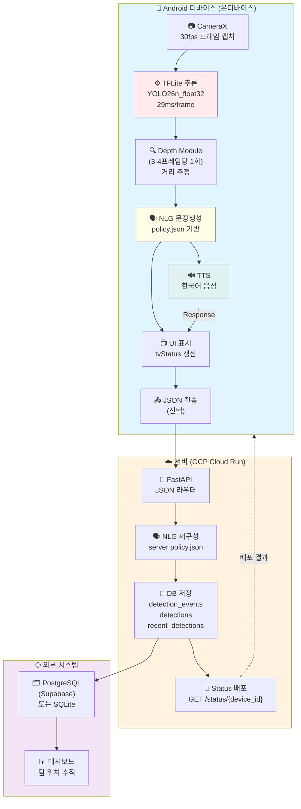
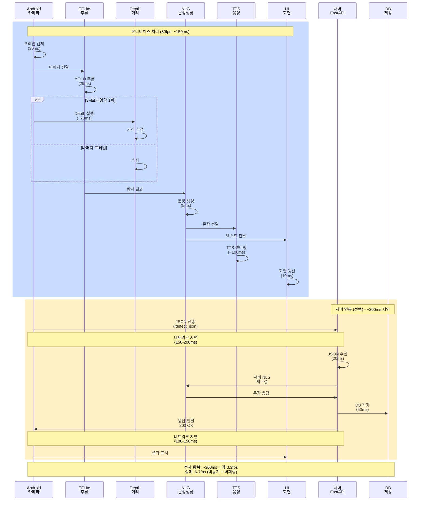
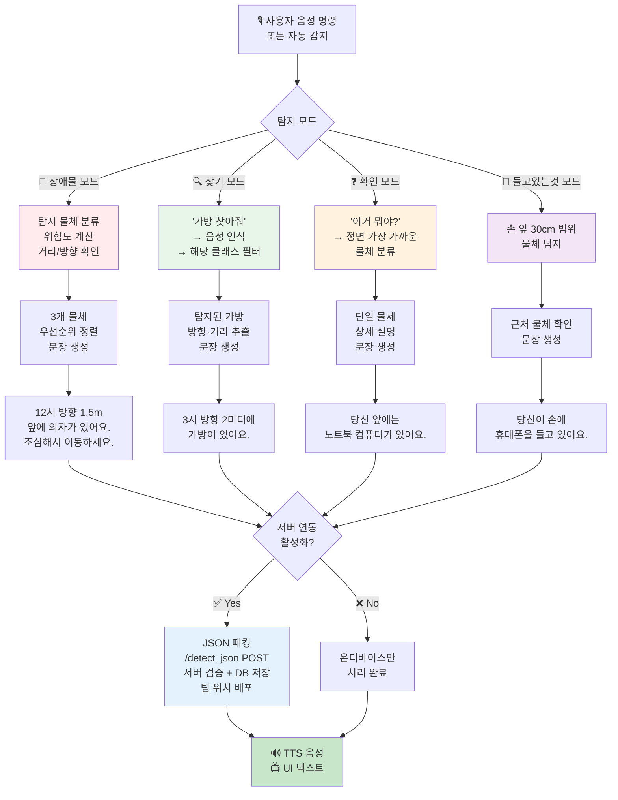
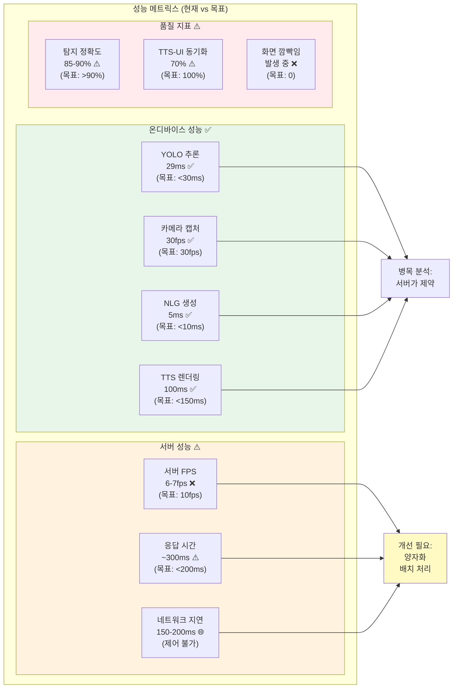

# VoiceGuide 아키텍처 & 성능 시각화

이 문서는 Mermaid 다이어그램을 포함하고 있습니다. 
GitHub, VS Code Preview, 또는 Mermaid 렌더러에서 보면 자동으로 그림이 표시됩니다.

---

## 1️⃣ 전체 시스템 아키텍처

---

## 2️⃣ 1회 탐지 사이클 (시간 흐름)

---

## 3️⃣ 4가지 사용 모드 흐름도

---

## 4️⃣ 성능 메트릭스: 현재 vs 목표

---

## 📌 어디서 열어볼까?

### VS Code에서:
1. 마크다운 미리보기 (⌘K ⌘V)
2. 또는 [이 파일을 GitHub에 푸시](https://github.com)하면 자동 렌더링

### 온라인 렌더러:
- https://mermaid.live/
- 코드를 복사해서 붙여넣으면 실시간 렌더링 가능

### 더 자세히:
- [CURRENT_STATUS_REPORT.md](../CURRENT_STATUS_REPORT.md) - 상세 분석
- [SIMULATION_RESULTS.md](../SIMULATION_RESULTS.md) - 테스트 결과
