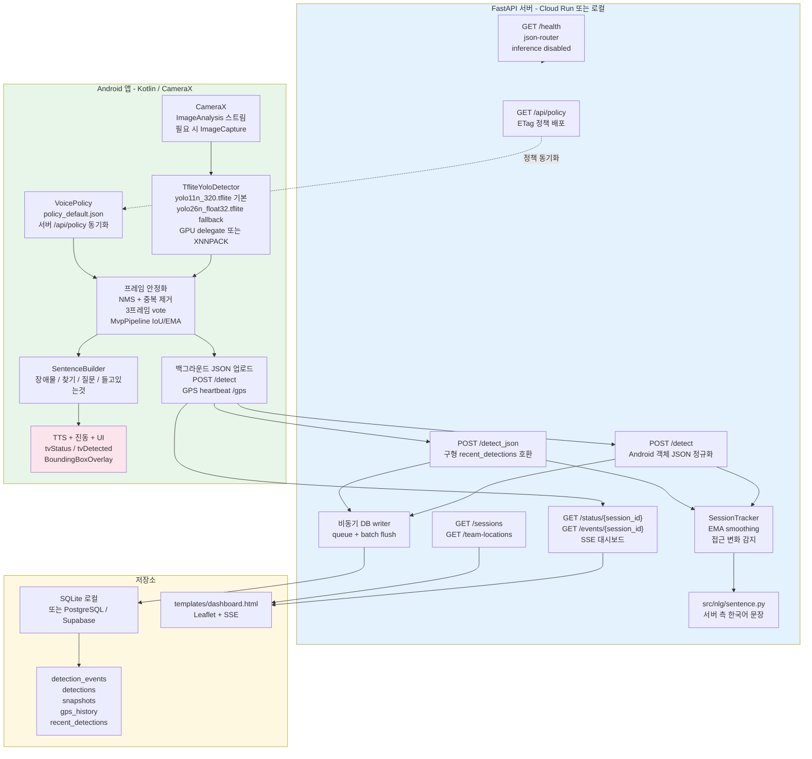
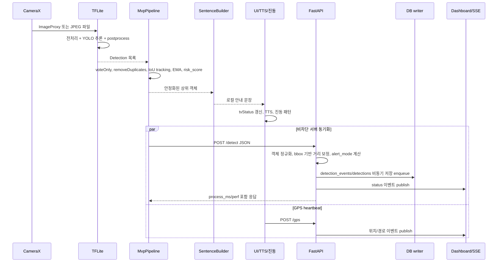
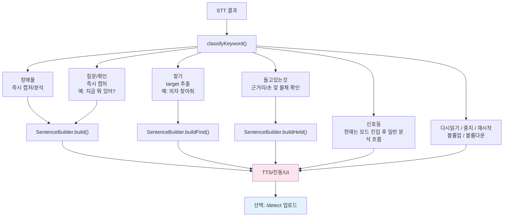
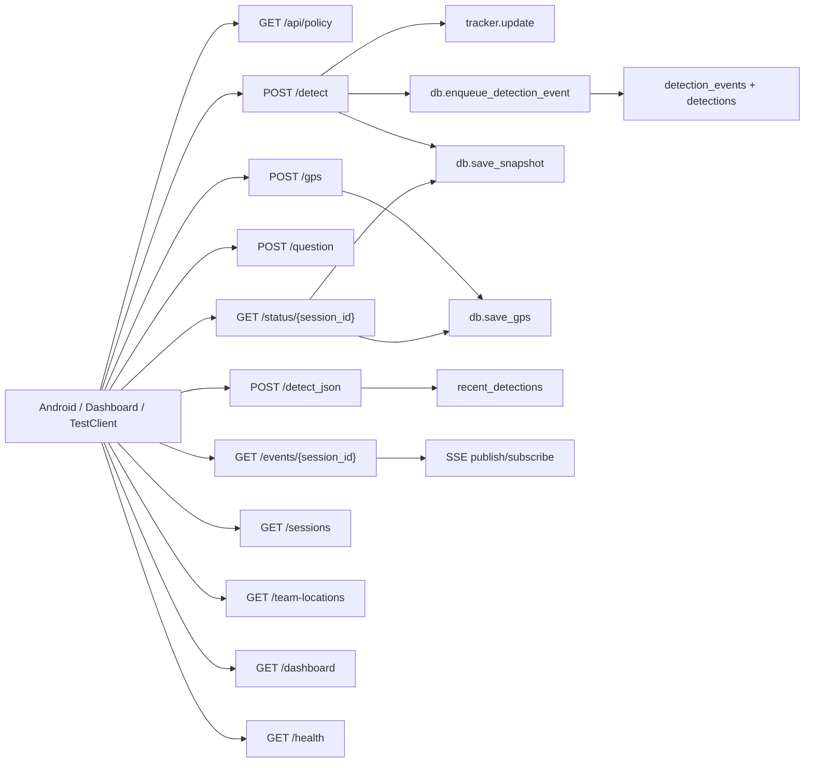
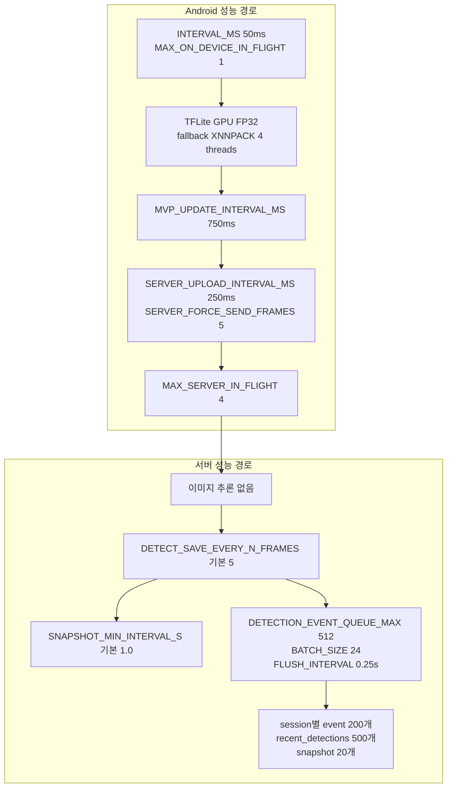

# VoiceGuide 아키텍처 다이어그램

현재 코드는 온디바이스 추론을 우선합니다. Android 앱이 CameraX 프레임에서 TFLite YOLO를 실행하고, 문장 생성과 TTS를 즉시 처리합니다. 서버는 이미 탐지된 JSON을 받아 tracker, DB, 대시보드, 기록 조회를 담당합니다.

---

## 1. 전체 시스템 구조

---

## 2. Android 1프레임 처리 흐름

핵심 포인트:

- 서버 응답을 기다린 뒤 말하지 않습니다. 사용자는 Android 로컬 `SentenceBuilder` 결과를 즉시 듣습니다.
- 서버는 이미지나 모델 추론을 수행하지 않습니다. `/health`도 `inference: disabled`를 반환합니다.
- `/detect`가 현재 Android 업로드 주 경로이고, `/detect_json`은 구형 포맷 및 테스트 호환용으로 남아 있습니다.

---

## 3. 음성 명령과 모드

---

## 4. 서버 API 표면

현재 `feature/jaehyun`의 `routes.py`에는 `/history`, `/routes`, `/gps/route/save`, `/locations` 계열 엔드포인트가 구현되어 있지 않습니다. Android 장소 저장/조회는 현재 앱 내부 `SharedPreferences` 흐름입니다.

---

## 5. 성능/안정화 지점

---

## 6. 현재 문서 기준

- Android 실제 구현: `android/app/src/main/java/com/voiceguide/`
- 서버 실제 구현: `src/api/routes.py`, `src/api/db.py`, `src/api/tracker.py`
- 문장 생성: Android `SentenceBuilder.kt`, 서버 `src/nlg/sentence.py`
- 정책 SSOT: `src/config/policy.json`, Android fallback `assets/policy_default.json`
- 상태 보고서: `CURRENT_STATUS_REPORT.md`
- 시뮬레이션 스크립트: `test_simulation.py`
