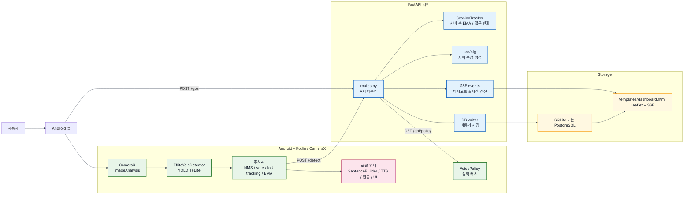
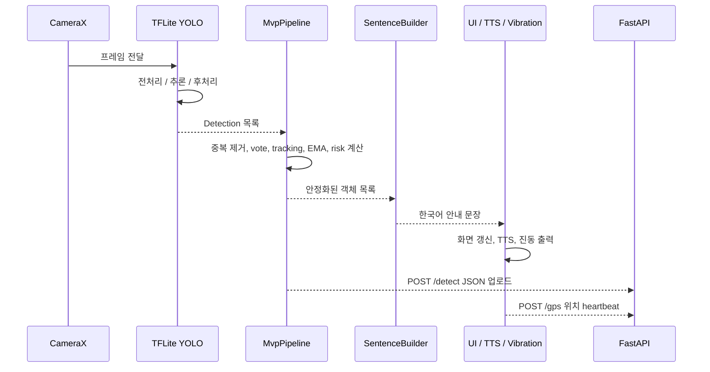
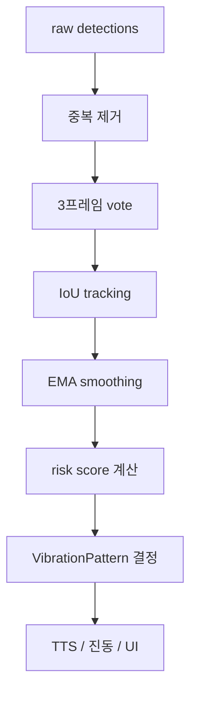
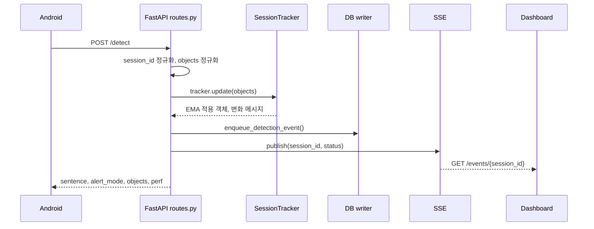

# VoiceGuide Architecture Diagrams

> 시각장애인 보행 보조를 위한 Android 온디바이스 탐지 + FastAPI 상태 동기화 시스템  
> 기준일: 2026-05-09  
> 현재 코드 기준: Android가 직접 YOLO를 실행하고, 서버는 JSON 라우터/기록/대시보드 역할을 담당한다.

---

## 1. 한 줄 요약

VoiceGuide는 **사용자 안전에 필요한 판단과 안내를 Android에서 즉시 처리**하고, 서버는 **탐지 결과 저장, 실시간 대시보드, 이력 조회, 정책 배포**를 담당한다.

서버가 이미지를 받아 YOLO를 돌리는 구조가 아니다. 현재 주 경로는 Android가 TFLite로 탐지한 결과를 `POST /detect` JSON으로 서버에 보내는 방식이다.

---

## 2. 전체 구조



---

## 3. 역할 분리

| 영역 | 담당 | 이유 |
|---|---|---|
| Android | 카메라, YOLO 추론, 위험도 계산, 진동, TTS, UI | 네트워크가 없어도 즉시 경고해야 함 |
| FastAPI | JSON 정규화, 세션 추적, DB 저장, 대시보드, API 제공 | 기록/모니터링/공유 상태를 안정적으로 관리 |
| DB | 탐지 이벤트, 객체 상세, GPS, 경로, 스냅샷 저장 | 대시보드와 이력 조회의 기준 데이터 |
| Dashboard | 현재 객체, 위치, 경로, 최근 이벤트 표시 | 보호자/개발자 모니터링 |

핵심 원칙:

- 긴급 경고는 Android 로컬에서 먼저 처리한다.
- 서버 응답이 늦어도 사용자의 TTS/진동 흐름이 멈추면 안 된다.
- 서버는 현재 이미지 추론을 하지 않는다. `/health`도 `inference: disabled`를 반환한다.
- 정책은 `src/config/policy.json`을 기준으로 하고 Android는 `policy_default.json`을 fallback으로 사용한다.

---

## 4. Android 1프레임 처리 흐름



### Android 주요 파일

| 파일 | 역할 |
|---|---|
| `android/app/src/main/java/com/voiceguide/MainActivity.kt` | 앱 메인 흐름. CameraX, STT/TTS, 서버 업로드, GPS, UI 연결 |
| `android/app/src/main/java/com/voiceguide/TfliteYoloDetector.kt` | TFLite YOLO 추론 엔진 |
| `android/app/src/main/java/com/voiceguide/MvpPipeline.kt` | IoU tracking, EMA, risk score, 진동 패턴 계산 |
| `android/app/src/main/java/com/voiceguide/SentenceBuilder.kt` | Android 로컬 한국어 안내 문장 생성 |
| `android/app/src/main/java/com/voiceguide/VoicePolicy.kt` | 서버 정책 동기화와 로컬 fallback 정책 로딩 |
| `android/app/src/main/java/com/voiceguide/BoundingBoxOverlay.kt` | 화면 위 bbox 표시 |
| `android/app/src/main/java/com/voiceguide/Detection.kt` | 탐지 결과 데이터 모델 |
| `android/app/src/main/assets/policy_default.json` | 서버 정책을 못 받을 때 쓰는 기본 정책 |

### Android 성능 관련 상수

| 상수 | 값 | 의미 |
|---|---:|---|
| `INTERVAL_MS` | 50ms | 프레임 처리 최소 간격 |
| `MAX_ON_DEVICE_IN_FLIGHT` | 1 | TFLite 동시 처리 수 |
| `MAX_SERVER_IN_FLIGHT` | 4 | 서버 동시 요청 수 |
| `MVP_UPDATE_INTERVAL_MS` | 750ms | MVP/TTS/JSON 갱신 주기 |
| `SERVER_UPLOAD_INTERVAL_MS` | 250ms | 서버 업로드 최소 간격 |
| `SERVER_FORCE_SEND_FRAMES` | 5 | 변화가 없어도 주기적으로 업로드 |
| `SERVER_OBJECT_LIMIT` | 5 | 서버에 보내는 객체 수 상한 |
| `SERVER_CONFIDENCE_MIN` | 0.45 | 서버 전송 confidence 하한 |
| `GPS_SEND_INTERVAL_MS` | 3000ms | GPS heartbeat 최소 간격 |

---

## 5. 위험 판단과 진동

Android의 `MvpPipeline.kt`가 사용자 안전에 필요한 1차 판단을 수행한다.



| 위험도 조건 | 진동 패턴 |
|---|---|
| `risk >= 0.75` | `URGENT` |
| `risk >= 0.55` | `DOUBLE` |
| `risk >= 0.35` | `SHORT` |
| 그 외 | `NONE` |

차량 객체는 더 보수적으로 처리한다. 차량이고 `risk >= 0.55`이면 `URGENT`로 상향한다.

---

## 6. 서버 처리 흐름



### 서버 주요 파일

| 파일 | 역할 |
|---|---|
| `src/api/main.py` | FastAPI 앱 생성, lifespan, CORS, `/health`, 전역 예외 처리 |
| `src/api/routes.py` | Android/대시보드가 호출하는 API 엔드포인트 |
| `src/api/db.py` | SQLite/PostgreSQL 초기화, 저장, 조회, 비동기 writer |
| `src/api/tracker.py` | session별 객체 추적, EMA, 접근 변화 감지 |
| `src/api/events.py` | SSE publish/subscribe |
| `src/nlg/sentence.py` | 서버 측 한국어 문장 생성 |
| `src/nlg/templates.py` | 방향/행동 문구 템플릿 |
| `src/config/policy.json` | 객체 분류와 온디바이스 정책의 기준 파일 |
| `src/config/policy.py` | 정책 로더 |
| `templates/dashboard.html` | 실시간 대시보드 |

---

## 7. API 표면

| Method | Path | 사용 주체 | 역할 |
|---|---|---|---|
| `GET` | `/health` | 운영/테스트 | 서버, DB, writer 상태 확인 |
| `GET` | `/api/policy` | Android | 정책 JSON 동기화. ETag 지원 |
| `POST` | `/detect` | Android | 현재 주 경로. 온디바이스 탐지 JSON 수신 |
| `POST` | `/detect_json` | Android/테스트 | 구형 포맷 호환용 탐지 수신 |
| `POST` | `/question` | Android | 최근 tracker/DB 상태 기반 질문 응답 |
| `POST` | `/gps` | Android | 현재 위치 저장 및 SSE 발행 |
| `POST` | `/gps/route/save` | Android/대시보드 | 현재 GPS track을 저장 경로로 확정 |
| `GET` | `/status/{session_id}` | 대시보드/테스트 | 현재 객체, GPS, track, latest_event 조회 |
| `GET` | `/events/{session_id}` | 대시보드 | SSE 실시간 상태 스트림 |
| `GET` | `/sessions` | 대시보드 | 최근 위치가 있는 session 목록 |
| `GET` | `/team-locations` | 대시보드 | 최근 팀 위치 조회 |
| `GET` | `/history/{session_id}` | 대시보드 | 최근 24시간 탐지 이력 |
| `GET` | `/routes/{session_id}` | 대시보드 | 저장된 GPS 경로 목록 |
| `GET` | `/routes/{session_id}/{route_id}` | 대시보드 | 특정 GPS 경로 좌표 |
| `GET` | `/dashboard` | 브라우저 | HTML 대시보드 |
| `POST` | `/spaces/snapshot` | 테스트/보조 | 공간 스냅샷 저장 |

인증:

- `API_KEY` 환경변수가 비어 있으면 인증 없이 동작한다.
- `API_KEY`가 설정되어 있으면 `Authorization: Bearer <key>` 또는 `X-API-Key: <key>`가 필요하다.

---

## 8. 데이터 저장 구조

`src/api/db.py`는 SQLite와 PostgreSQL을 모두 지원한다. `DATABASE_URL`이 있으면 PostgreSQL, 없으면 로컬 SQLite를 사용한다.

| 테이블 | 용도 |
|---|---|
| `detection_events` | 탐지 이벤트 단위 원본/요약 |
| `detections` | 이벤트별 객체 상세 |
| `snapshots` | session별 최근 공간 상태 |
| `saved_locations` | 저장 장소 |
| `gps_history` | 현재 이동 중인 GPS track |
| `gps_routes` | 저장 완료된 GPS 경로 |
| `recent_detections` | `/detect_json` 호환과 질문 복원 보조 |

저장 전략:

- `/detect`는 매 프레임 전부 저장하지 않는다.
- 기본적으로 `DETECT_SAVE_EVERY_N_FRAMES=5`마다 저장한다.
- 객체 구성이 바뀌었고 `SNAPSHOT_MIN_INTERVAL_S=1.0` 조건을 만족하면 저장한다.
- 질문 모드는 저장 우선순위가 높다.
- DB writer는 background thread + queue 방식으로 API 응답 지연을 줄인다.

---

## 9. 모드와 음성 명령

Android는 STT 결과를 분류해 현재 사용 중인 모드로 연결한다.

| 모드 | 예시 | 처리 |
|---|---|---|
| 장애물 | "앞에 뭐 있어" | 일반 탐지 안내 |
| 질문 | "지금 뭐 보여?" | 현재 프레임과 tracker 상태를 요약 |
| 볼륨 | "볼륨 올려", "볼륨 내려" | 시스템 볼륨 조절 |

문장 생성은 두 군데에 있다.

| 위치 | 파일 | 용도 |
|---|---|---|
| Android | `SentenceBuilder.kt` | 사용자에게 즉시 말하는 로컬 안내 |
| 서버 | `src/nlg/sentence.py` | API 응답, 대시보드, 질문 복원용 안내 |

---

## 10. 정책 파일

정책의 기준은 서버의 `src/config/policy.json`이다.

Android는 앱 시작 또는 필요 시 `/api/policy`로 정책을 받아 캐시한다. 서버에 접근할 수 없으면 `android/app/src/main/assets/policy_default.json`을 사용한다.

| 항목 | 예시 역할 |
|---|---|
| 클래스 그룹 | 차량, 동물, 위험물, 주의 객체 분류 |
| 거리 보정값 | bbox 면적 기반 거리 추정 계수 |
| vote bypass | 계단/차량처럼 보팅 없이 통과할 객체 |
| TTS/NLG 기준 | 안내 문장 생성에 필요한 분류 기준 |

---

## 11. 실행 방법

### 서버

```bash
pip install -r requirements.txt
cp .env.example .env
uvicorn src.api.main:app --host 0.0.0.0 --port 8000
```

확인:

```bash
curl http://localhost:8000/health
```

배포 서버:

```text
https://voiceguide-1063164560758.asia-northeast3.run.app
```

### Android

1. Android Studio에서 `android/` 폴더를 연다.
2. Gradle Sync를 실행한다.
3. USB 디버깅이 켜진 Android 기기를 연결한다.
4. 앱을 실행한다.
5. 필요하면 앱 설정에서 서버 URL을 지정한다.

서버 URL이 없어도 로컬 TTS/진동 중심의 오프라인 동작은 가능해야 한다.

---

## 12. 테스트와 검증

### 서버 단위/회귀 테스트

```bash
python -m pytest tests/ -v -m "not integration"
```

### 실제 서버 대상 integration 테스트

```bash
uvicorn src.api.main:app --host 0.0.0.0 --port 8000
python -m pytest tests/test_server.py -v -m integration
```

### 시뮬레이션

```bash
python test_simulation.py
```

### Android 빌드

```powershell
cd android
.\gradlew.bat assembleDebug
```

---

## 13. 현재 중요한 제약

| 제약 | 설명 |
|---|---|
| 서버 추론 없음 | 서버는 이미지나 YOLO 모델을 실행하지 않는다 |
| 거리 추정 | 현재 주 경로는 bbox 면적 기반 거리 추정이다 |
| FastDepth | 교체/통합 완료 상태가 아니다 |
| `/detect_json` | 구형 호환용이다. 현재 주 경로는 `/detect`이다 |
| 네트워크 지연 | 안전 경고는 서버 왕복에 의존하면 안 된다 |
| 정책 불일치 | 서버 정책과 Android fallback 정책이 어긋나면 안내가 달라질 수 있다 |

---

## 14. 디렉터리 지도

```text
VoiceGuide/
├─ android/
│  └─ app/src/main/
│     ├─ assets/
│     │  └─ policy_default.json
│     ├─ java/com/voiceguide/
│     │  ├─ MainActivity.kt
│     │  ├─ TfliteYoloDetector.kt
│     │  ├─ MvpPipeline.kt
│     │  ├─ SentenceBuilder.kt
│     │  ├─ VoicePolicy.kt
│     │  ├─ VoiceGuideConstants.kt
│     │  ├─ BoundingBoxOverlay.kt
│     │  └─ Detection.kt
│     └─ res/
├─ src/
│  ├─ api/
│  │  ├─ main.py
│  │  ├─ routes.py
│  │  ├─ db.py
│  │  ├─ tracker.py
│  │  └─ events.py
│  ├─ config/
│  │  ├─ policy.json
│  │  └─ policy.py
│  └─ nlg/
│     ├─ sentence.py
│     └─ templates.py
├─ templates/
│  └─ dashboard.html
├─ tests/
├─ tools/
├─ train/
├─ docs/
│  ├─ ARCHITECTURE_DIAGRAM.md
│  └─ CURRENT_STATUS_REPORT.md
├─ Dockerfile
└─ requirements.txt
```

---

## 15. 읽는 순서 추천

처음 온 개발자는 아래 순서로 보면 빠르다.

1. 이 문서 `docs/ARCHITECTURE_DIAGRAM.md`
2. `android/app/src/main/java/com/voiceguide/MainActivity.kt`
3. `android/app/src/main/java/com/voiceguide/MvpPipeline.kt`
4. `src/api/routes.py`
5. `src/api/db.py`
6. `templates/dashboard.html`
7. `docs/CURRENT_STATUS_REPORT.md`
